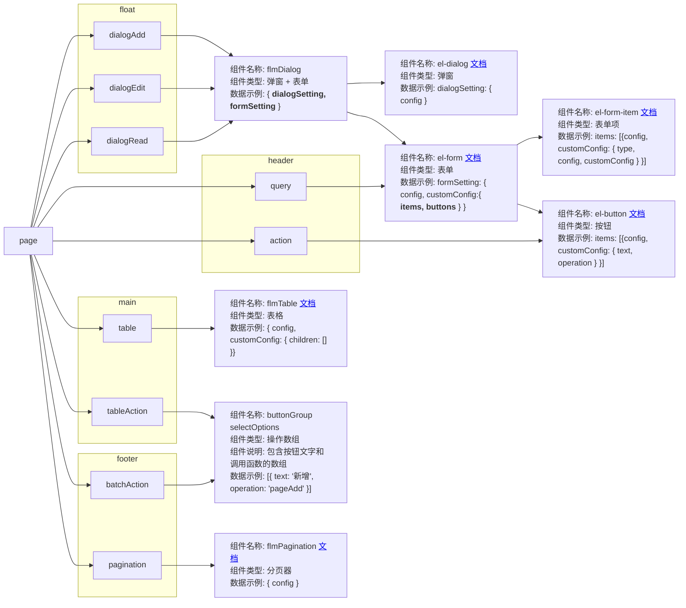

# 页面配置数据
* page结构图，请使用typora打开查看



```js
// 页面设置
pageSetting: {
  // 表格
  table: {
    config: {},      // el-table 默认设置
    customConfig: {  // el-table 自定义设置
      children: [    // 列配置
        {
          config: {},       // el-column 默认设置
          customConfig: {   // el-column 自定义设置
            isSlot: false,  // 当前列是否是插槽
            children: [     // 当前列的子列
              {
                config: {},
                customConfig: {
                  isSlot: false,
                  children: [...]  // 可无限嵌套
                }
              }
            ],
          }
        }
      ]
    }
  },
  // 表格操作
  tableAction: [
    {
      buttonText: "编辑",      // 按钮文字
      operation: "tableEdit"  // 调用函数
    }
  ],
  // 新增弹窗
  dialogAdd: {
    dialogSetting: {    // 弹窗
      config: {},       // el-dialog设置
      customConfig: {}  // el-dialog自定义设置（暂无）
    },
    formSetting: {  // 新增表单设置
      config: {},   // el-form默认设置
      customConfig: {
        items: [    // 表单项
          {
            config: {},      // el-form-item 默认配置
            customConfig: {  // el-form-item 自定义配置
              type: 'input',     // 控件类型
              config: {},        // 控件配置
              customConfig: {},  // 控件自定义配置
            },
          }
        ],
        buttons: [  // 表单按钮
          config: {},               // el-button 默认设置
          customConfig: {           // el-button 自定义设置
            buttonText: "新增"       // 按钮文字
            operation: "pageQuery"  // 调用函数
          }
        ]
      }
    }
  },
  // 编辑弹窗
  dialogEdit: {
    dialogSetting: {    // 弹窗
      config: {},       // el-dialog设置
      customConfig: {}  // el-dialog自定义设置（暂无）
    },
    formSetting: {  // 编辑表单设置
      config: {},   // el-form默认设置
      customConfig: {
        items: [    // 表单项
          {
            config: {},      // el-form-item 默认配置
            customConfig: {  // el-form-item 自定义配置
              type: 'input',     // 控件类型
              config: {},        // 控件配置
              customConfig: {},  // 控件自定义配置
            },
          }
        ],
        buttons: [                  // 表单按钮
          config: {},               // el-button 默认设置
          customConfig: {           // el-button 自定义设置
            buttonText: "保存编辑"   // 按钮文字
            operation: "pageQuery"  // 调用函数
          }
        ]
      }
    }
  },
  // 查询
  query: {
    config: {},  // el-form默认设置
    customConfig: {
      items: [    // 表单项
          {
            config: {},      // el-form-item 默认配置
            customConfig: {  // el-form-item 自定义配置
              type: 'input',     // 控件类型
              config: {},        // 控件配置
              customConfig: {},  // 控件自定义配置
            },
          }
        ],
        buttons: [  // 表单按钮
          {
            config: {},               // el-button 默认设置
            customConfig: {           // el-button 自定义设置
              buttonText: "查询"       // 按钮文字
              operation: "pageQuery"  // 调用函数
            }
          }
        ]
    }
  },
  // 操作栏
  action: [
    {
      config: {},              // el-button 默认设置
      customConfig: {          // el-button 自定义设置
        buttonText: "新增"     // 按钮文字
        operation: "pageAdd"  // 调用函数
      }
    }
  ],
  // 批量操作栏
  batchAction: [
    {
      buttonText: "批量删除"          // 选项文字
      operation: "pageBatchDelete"  // 调用函数
    }
  ],
  // 分页
  pagination: {}  // el-pagination默认设置
},
```